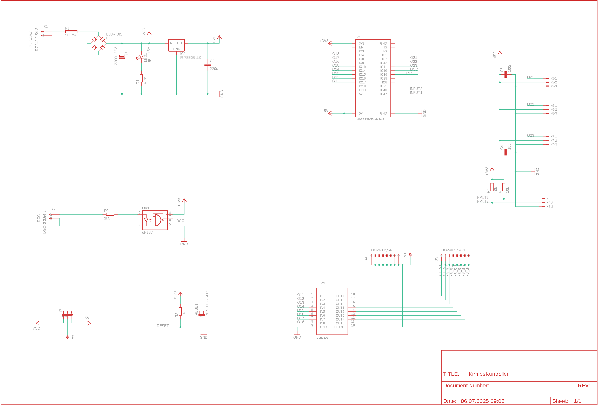
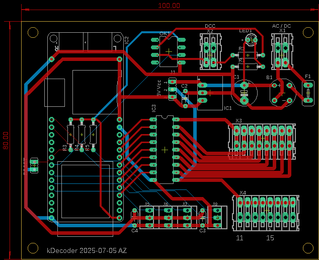

# Kirmes kontroller

## Controller
[YB-ESP32-S3-AMP](https://github.com/yellobyte/YB-ESP32-S3-AMP)

## Librarys
 - [ESP32-audioI2S](https://github.com/schreibfaul1/ESP32-audioI2S) - Audio-Wiedergabe über I2S
 - [IotWebConf](https://github.com/prampec/IotWebConf) - Web-Konfigurationsoberfläche
 - [ArduinoOTA](https://github.com/esp8266/Arduino/tree/master/libraries/ArduinoOTA) - Over-The-Air Updates

# Pin mapping
## internal pins
```c++
#define SD_CS         10 
#define SPI_MOSI      11
#define SPI_MISO      13
#define SPI_SCK       12
#define I2S_DOUT       7
#define I2S_BCLK       5
#define I2S_LRCLK      6
#define LED_BUILTIN   47

#define DCC_INPUT     40
#define WIFI_RESET    39
```
## external pins
```
static uint8_t ChannelToGPIOMapping[16] = {
	17, // O11
	16, // O12
	15, // O13
	14, // O14
	10, // O15
	9,  // O16
	8,  // O17
	4,  // O18

	2, // O21
	42, // O22
	41, // O23
};

#define INPUT1        21
#define INPUT2        38
```

## Schema


## Board


## Kirmes sounds
https://www.pond5.com/de/search?kw=karussell-unterhaltung-park-kirmes&media=sfx