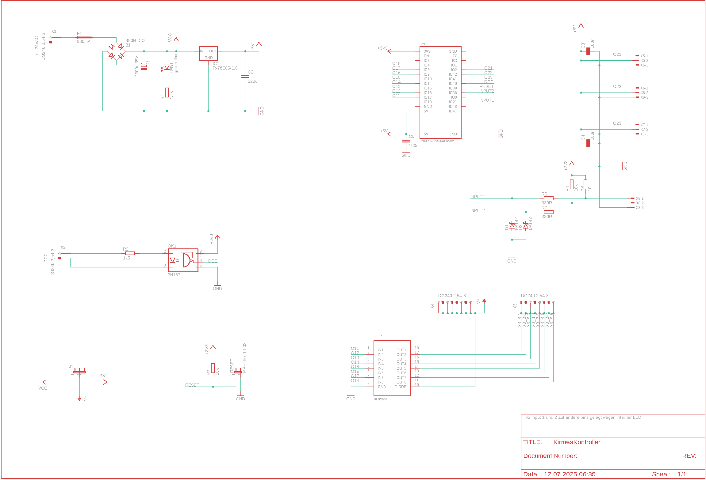
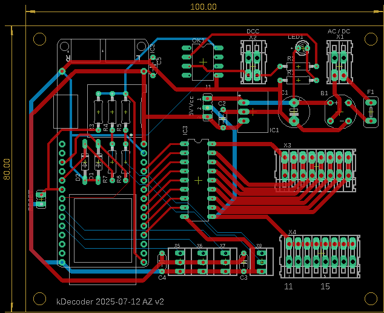

# Kirmes kontroller
- [Kirmes kontroller](#kirmes-kontroller)
	- [Beschreibung](#beschreibung)
		- [Hauptfunktionen](#hauptfunktionen)
		- [Technische Spezifikationen](#technische-spezifikationen)
	- [Anschlüsse](#anschlüsse)
		- [Klemmenblöcke](#klemmenblöcke)
		- [Jumper-Einstellungen](#jumper-einstellungen)
	- [Controller](#controller)
	- [Librarys](#librarys)
	- [Pin mapping](#pin-mapping)
	- [internal pins](#internal-pins)
	- [external pins](#external-pins)
	- [Schema](#schema)
	- [Board](#board)
		- [Notwendige Änderungen auf v1 board](#notwendige-änderungen-auf-v1-board)
	- [Partliste](#partliste)
	- [Audio-Wiedergabe](#audio-wiedergabe)
		- [Unterstützte Audioformate](#unterstützte-audioformate)
		- [SD-Karte Setup](#sd-karte-setup)
		- [Kirmes-Sounds Quellen](#kirmes-sounds-quellen)
		- [Sounddateien bearbeiten](#sounddateien-bearbeiten)
			- [Online-Audio-Editoren](#online-audio-editoren)
			- [Desktop-Software](#desktop-software)
			- [Bearbeitungs-Tipps für Kirmes-Sounds](#bearbeitungs-tipps-für-kirmes-sounds)
			- [Batch-Verarbeitung](#batch-verarbeitung)
	- [Konfiguration](#konfiguration)
		- [System-Konfiguration](#system-konfiguration)
			- [System Configuration](#system-configuration)
			- [Sound Settings](#sound-settings)
			- [ServoOutput Konfiguration](#servooutput-konfiguration)
			- [Output Konfiguration](#output-konfiguration)
			- [Bedienelemente](#bedienelemente)
			- [Navigation](#navigation)
	- [WiFi](#wifi)
		- [Standard-Passwort](#standard-passwort)
		- [Standard-IP-Adresse](#standard-ip-adresse)
		- [OTA (Over-The-Air Updates)](#ota-over-the-air-updates)
		- [Konfigurationsoptionen](#konfigurationsoptionen)
		- [Blinkcodes](#blinkcodes)
	- [Firmware](#firmware)
		- [Firmware-Update über Web-Interface](#firmware-update-über-web-interface)
		- [Firmware-Update über OTA](#firmware-update-über-ota)
	- [Reset](#reset)
		- [Reset-Vorgang](#reset-vorgang)


## Beschreibung

Der KirmesKontroller ist ein vielseitiger NMRA-DCC-Decoder, der speziell für Kirmes- und Karussell-Anwendungen entwickelt wurde. Basierend auf dem leistungsstarken YB-ESP32-S3-AMP Mikrocontroller, bietet er umfangreiche Steuerungs- und Audio-Funktionen.

### Hauptfunktionen

**Ausgänge:**

- 8 digitale Ausgänge für Beleuchtung, Motoren und Effekte
- 3 Servo-Ausgänge für präzise Bewegungssteuerung
- Maximale Belastung: 500mA pro Ausgang

**Eingänge:**

- 2 digitale Eingänge für Taster- und Sensorfunktionen
- Manueller Betrieb unabhängig vom DCC-Signal möglich

**Konnektivität:**

- WiFi-Access-Point für direkten Zugriff
- Integration in bestehende WiFi-Netzwerke
- Web-basierte Konfigurationsoberfläche
- Over-The-Air (OTA) Updates

**Steuerungsmöglichkeiten:**

- **DCC-Kommandos:** Standard NMRA-DCC-Protokoll
- **Web-Interface:** Browserbasierte Steuerung
- **Digitale Eingänge:** Lokale Taster und Sensoren

**Audio-System:**

- Integrierte I2S-Audio-Wiedergabe
- SD-Karten-Unterstützung für Sounddateien
- Vielfältige Audioformate (MP3, WAV, FLAC, etc.)

### Technische Spezifikationen

**Stromversorgung:**

- **DC-Betrieb:** 8-28V Gleichspannung
- **AC-Betrieb:** 18-36V Wechselspannung
- **Ausgangsleistung:** 500mA pro Kanal
- **Wichtiger Hinweis:** Bei Jumper J1 auf Position "5V" darf der Gesamtstrom 1A nicht überschreiten

**Abmessungen und Anschlüsse:**

- Kompakte Bauform für einfache Integration
- Schraubklemmen für sichere Verbindungen
- Status-LEDs für visuelles Feedback

## Anschlüsse

### Klemmenblöcke

| Klemme | Beschreibung | Spezifikation |
|--------|--------------|---------------|
| **X1** | Versorgungsspannung | 8-28V DC / 18-36V AC |
| **X2** | DCC-Signal | NMRA-DCC-Eingang |
| **X3** | Verbraucher (-) | Gemeinsamer Minuspol |
| **X4** | Verbraucher (+) | 5V/12-28V DC (abhängig von J1) |
| **X5-X7** | Servo-Anschlüsse | PWM-Ausgänge für Servos |
| **X8** | Digitale Eingänge | Input 1 und 2 |

### Jumper-Einstellungen

**J1 - Ausgangsspannung:**

- Position "5V": Ausgänge mit 5V (max. 1A Gesamtstrom)
- Position "VIN": Ausgänge mit Eingangsspannung (max. 500mA pro Ausgang)

## Controller

[YB-ESP32-S3-AMP](https://github.com/yellobyte/YB-ESP32-S3-AMP)

## Librarys

- [ESP32-audioI2S](https://github.com/schreibfaul1/ESP32-audioI2S) - Audio-Wiedergabe über I2S
- [IotWebConf](https://github.com/prampec/IotWebConf) - Web-Konfigurationsoberfläche
- [ArduinoOTA](https://github.com/esp8266/Arduino/tree/master/libraries/ArduinoOTA) - Over-The-Air Updates

## Pin mapping

## internal pins

```c++
#define SD_CS         10 
#define SPI_MOSI      11
#define SPI_MISO      13
#define SPI_SCK       12
#define I2S_DOUT       7
#define I2S_BCLK       5
#define I2S_LRCLK      6
#define LED_BUILTIN   47

#define DCC_INPUT     40
#define WIFI_RESET    39

```

## external pins

```c++
static uint8_t ChannelToGPIOMapping[16] = {
	17, // O11
	16, // O12
	15, // O13
	14, // O14
	10, // O15
	9,  // O16
	8,  // O17
	4,  // O18

	2, // O21
	42, // O22
	41, // O23
};

#define INPUT1        21
#define INPUT2        38
```

## Schema



## Board



### Notwendige Änderungen auf v1 board

## Partliste

| Part | Value |
|------|-------|
| B1 | B80R DIO |
| C1 | 2200u 35V |
| C2 | 220u |
| C3 | 100n |
| C4 | 100n |
| C5 | 100n |
| D1 | BAT42 |
| D2 | BAT42 |
| F1 | 900mA |
| IC1 | R-78E05-1.0 |
| IC2 | YB-ESP32-S3-AMP-V2 |
| IC3 | ULN2803 |
| J1 | MPE 087-1-003 |
| LED1 | green 3mm |
| OK1 | 6N137 |
| R1 | 4.7k |
| R2 | 1k5 |
| R3 | 10k |
| R4 | 10k |
| R5 | 10k |
| R6 | 330R |
| R7 | 330R |
| RESET | MPE 087-1-002 |
| X1 | DG240 2,54-2 |
| X2 | DG240 2,54-2 |
| X3 | DG240 2,54-8 |
| X4 | DG240 2,54-8 |
| X5 | 22-23-2031 |
| X6 | 22-23-2031 |
| X7 | 22-23-2031 |
| X8 | 22-23-2031 |


## Audio-Wiedergabe

Der KirmesKontroller unterstützt die Wiedergabe von Sounddateien über das integrierte I2S-Interface. Die Audiodaten werden von einer SD-Karte gelesen und über den angeschlossenen Verstärker ausgegeben.

### Unterstützte Audioformate

| Format | Spezifikation | Bemerkungen |
|--------|---------------|-------------|
| **MP3** | Standard | Vollständig unterstützt |
| **AAC** | Standard | Vollständig unterstützt |
| **AACP** | Mono | Nur Mono-Wiedergabe |
| **WAV** | 8/16 Bit | Bits per Sample: 8 oder 16 |
| **FLAC** | Verlustfrei | Blockgrösse max. 24.576 Bytes |
| **Vorbis** | ≤196 kBit/s | Bitrate-Begrenzung beachten |
| **M4A** | Standard | Vollständig unterstützt |

### SD-Karte Setup

Die Audiodateien müssen auf einer SD-Karte gespeichert werden.

**Empfohlene SD-Karten-Struktur:**

```text
/sounds/
├── ambient/
│   ├── carousel.mp3
│   └── fairground.wav
├── effects/
│   ├── bell.mp3
│   └── whistle.wav
└── music/
    ├── waltz.mp3
    └── polka.mp3
```

### Kirmes-Sounds Quellen

Für authentische Kirmes- und Karussell-Sounds:

- **Pond5:** [Karussell & Kirmes Sounds](https://www.pond5.com/de/search?kw=karussell-unterhaltung-park-kirmes&media=sfx)
- **Freesound.org:** Community-basierte Sammlung von Soundeffekten
- **YouTube Audio Library:** Kostenlose Hintergrundmusik und Effekte

### Sounddateien bearbeiten

Für die optimale Nutzung mit dem KirmesKontroller sollten Audiodateien entsprechend bearbeitet werden. Hier sind einige nützliche Tools und Tipps:

#### Online-Audio-Editoren

**Audio Cutter** - Kostenloser Online-Editor für MP3-Dateien:

- **Features:** Schneiden, Trimmen, Fade-In/Out, Lautstärke anpassen
- **Formate:** MP3, WAV, M4A, FLAC, OGG, AMR, MP4
- **Link:** [Audio Cutter](https://www.audiocutter.org/de/mp3-cutter-online)

**TwistedWave Online** - Erweiterte Audio-Bearbeitung:

- **Features:** Mehrspur-Bearbeitung, Effekte, Normalisierung
- **Formate:** WAV, MP3, AIFF, FLAC, OGG
- **Link:** [TwistedWave](https://twistedwave.com/online/)

#### Desktop-Software

**Audacity** (Kostenlos):

- Professionelle Audio-Bearbeitung
- Unterstützt alle gängigen Formate
- Plugins für Spezialeffekte
- **Download:** [audacityteam.org](https://www.audacityteam.org/)

#### Bearbeitungs-Tipps für Kirmes-Sounds

**Loops erstellen:**

- Nahtlose Wiederholungen für Hintergrundmusik
- Fade-Out am Ende und Fade-In am Anfang vermeiden Knackgeräusche
- Optimale Loop-Länge: 30-120 Sekunden

**Lautstärke normalisieren:**

- Alle Sounds auf einheitliche Lautstärke bringen
- Empfohlener Pegel: -6 dB bis -3 dB
- Vermeidung von Clipping (Übersteuerung)

**Dateioptimierung:**

- **MP3:** 128-320 kBit/s für gute Qualität
- **WAV:** 16 Bit, 44.1 kHz für unkomprimierte Qualität
- **Dateiname:** Kurze, aussagekräftige Namen ohne Sonderzeichen

#### Batch-Verarbeitung

Für grössere Sammlungen:

- **FFmpeg** (Kommandozeilen-Tool) für automatische Konvertierung
- **Audacity** mit Makros für wiederkehrende Bearbeitungen
- **Format Factory** für Windows-Nutzer

## Konfiguration

Die Konfiguration des KirmesKontrollers erfolgt über das Web-Interface, das unter der IP-Adresse des Geräts erreichbar ist. Nach der erfolgreichen Verbindung können Sie auf die Konfigurationsseite zugreifen.

### System-Konfiguration

Die System-Konfiguration ist über `http://[IP-Adresse]/config` erreichbar und bietet folgende Einstellungsmöglichkeiten:

#### System Configuration

**Thing name:**
- Name des KirmesKontrollers (z.B. `kDecoder`)
- Eindeutige Identifikation im Netzwerk

**AP password:**
- Passwort für den Access Point Modus
- Wird verwendet, wenn keine WLAN-Verbindung besteht

**WiFi SSID:**
- Name des WLAN-Netzwerks (z.B. `1000-2575`)
- Netzwerk für die Internetverbindung

**WiFi password:**
- Passwort für das WLAN-Netzwerk

**Startup delay (seconds):**
- Verzögerung beim Start in Sekunden (z.B. `5`)
- Zeit bis zur vollständigen Initialisierung

#### Sound Settings

**Volume:**
- Lautstärke-Einstellung (0-21, z.B. `5`)
- Globale Audio-Lautstärke

**Mono:**
- Mono-Audio-Wiedergabe aktivieren/deaktivieren

**Balance:**
- Stereo-Balance-Einstellung (z.B. `0`)
- Links (16) / Rechts (-16) -Verteilung der Audio-Ausgabe

#### ServoOutput Konfiguration

Für jeden Servo-Ausgang können folgende Parameter konfiguriert werden:

**Designation:**
- Bezeichnung des Servos (z.B. `Karussel`)
- Beschreibender Name für die Identifikation

**Mode:**
- Betriebsmodus (z.B. `Motor (1)`)
- Definiert das Verhalten des Servo-Ausgangs

**DCC Address:**
- DCC-Adresse für die Steuerung (z.B. `3`)
- NMRA-DCC-Protokoll-Adresse

**Start delay (ms):**
- Startverzögerung in Millisekunden (z.B. `130`)
- Verzögerung vor der Aktivierung

**Multiplier:**
- Multiplikator für die Geschwindigkeit (z.B. `20`)
- Faktor zur Geschwindigkeitsanpassung

**Motor Speed:**
- Motorgeschwindigkeit (0-255, z.B. `255`)
- PWM-Wert für die Geschwindigkeit

**Filename:**
- Audio-Datei (z.B. `/carousel-sound-looped.mp3`)
- Sound-Datei von der SD-Karte

**Active Duration (ms):**
- Aktive Dauer in Millisekunden (z.B. `30000`)
- Laufzeit des Effekts

**Input Pin:**
- Zugeordneter Eingang (z.B. `Input1`)
- Digitaler Eingang für manuelle Steuerung

#### Output Konfiguration

Für jeden digitalen Ausgang können folgende Parameter konfiguriert werden:

**Designation:**
- Bezeichnung des Ausgangs (z.B. `Feuer`)
- Beschreibender Name

**Mode:**
- Betriebsmodus (z.B. `Feuer (3)`)
- Spezifischer Effekt-Modus

**DCC Address:**
- DCC-Adresse (z.B. `3`)
- Steuerungsadresse

**Brightness:**
- Helligkeit (0-255, z.B. `255`)
- PWM-Wert für die Helligkeit

**Filename:**
- Audio-Datei (optional)
- Begleitender Sound-Effekt

**Active Duration (ms):**
- Aktive Dauer (z.B. `1000`)
- Laufzeit des Effekts

**Input Pin:**
- Zugeordneter Eingang (z.B. `-` für nicht zugeordnet)
- Manuelle Steuerung

#### Bedienelemente

**+ ServoOutput:**
- Neuen Servo-Ausgang hinzufügen

**+ Output:**
- Neuen digitalen Ausgang hinzufügen

**Remove this set:**
- Konfiguration löschen

**Apply:**
- Einstellungen speichern und anwenden

#### Navigation

**Home:**
- Zur Hauptseite zurückkehren

**Reset:**
- System zurücksetzen

**Firmware update:**
- Firmware-Update durchführen

## WiFi

### Standard-Passwort

Wenn nicht mit einem AP verbunden, ist das Standardpasswort `123456789`

### Standard-IP-Adresse

Wenn nicht mit einem AP verbunden, ist die IP-Adresse `192.168.4.1`

### OTA (Over-The-Air Updates)

OTA ist aktiviert und kann verwendet werden. Damit ist es möglich, die Software des KirmesKontrollers zu updaten ohne unter die Anlage kriechen zu müssen. Die IP-Adresse ist entweder die Standard-IP-Adresse oder die vom AP zugewiesene. Port ist Standard.

### Konfigurationsoptionen

Nach dem ersten Start müssen einige Werte eingerichtet werden:

| Parameter | Beschreibung |
|-----------|--------------|
| **Thing name** | Name des Decoders. Es sollten keine Sonderzeichen und Umlaute verwendet werden. Punkte und Leerzeichen sollten ebenfalls nicht verwendet werden. |
| **AP password** | Dieses Passwort wird verwendet, wenn Sie später auf das Gerät zugreifen möchten. Sie müssen ein Passwort mit mindestens 8, höchstens 32 Zeichen verwenden. Es steht Ihnen frei, beliebige Zeichen zu verwenden. Es sollte ein Passwort mit mindestens 12 Zeichen Länge gewählt werden. |
| **WiFi SSID** | Name des WLAN mit welchem der KirmesKontroller verwendet werden soll. |
| **WiFi password** | Das Passwort zum Netzwerk, mit welchem der KirmesKontroller verbunden werden soll. |

### Blinkcodes

Die nachfolgende Tabelle fasst die verschiedenen Blinkcodes der Status-LED zusammen:

| Blinkcode | Bedeutung |
|-----------|-----------|
| **Rasches Blinken** | Meistens ein, unterbrochen durch kurze Aus-Perioden. Eigener AP ist aktiviert und Sie können mit dem Smartphone oder einem Computer eine Verbindung zum KirmesKontroller herstellen. |
| **Wechselblinken** | Der KirmesKontroller versucht mit einem AP zu verbinden. |
| **Langsames Blinken** | Meistens aus mit kurzem Blinken. Der KirmesKontroller ist online und mit dem WLAN verbunden. |

## Firmware

Hier kann, eine entsprechende Datei vorausgesetzt, die Firmware des KirmesKontrollers aktualisiert werden.

### Firmware-Update über Web-Interface

1. Navigieren Sie zur Web-Oberfläche des KirmesKontrollers
2. Wählen Sie die entsprechende Firmware-Datei (*.bin)
3. Starten Sie den Upload-Vorgang
4. Warten Sie, bis der Update-Prozess abgeschlossen ist
5. Das Gerät startet automatisch neu

### Firmware-Update über OTA

- Verwenden Sie die Arduino IDE oder PlatformIO
- Verbinden Sie sich mit der IP-Adresse des KirmesKontrollers
- Laden Sie die neue Firmware direkt hoch

## Reset

Wurde das Passwort vergessen oder funktioniert der KirmesKontroller nicht mehr, kann durch Schliessen des Jumpers RESET während dem Booten der Decoder auf die Werkseinstellungen zurückgesetzt werden.

### Reset-Vorgang

1. **Gerät ausschalten**
2. **RESET-Jumper schliessen** (siehe Platine)
3. **Gerät einschalten** und 10 Sekunden warten
4. **RESET-Jumper öffnen**
5. **Gerät neu starten**

Nach dem Reset sind folgende Standardwerte aktiv:

- **WiFi-Modus:** Access Point
- **SSID:** KirmesKontroller-[MAC]
- **Passwort:** 123456789
- **IP-Adresse:** 192.168.4.1
- **Alle Konfigurationen:** Zurückgesetzt

